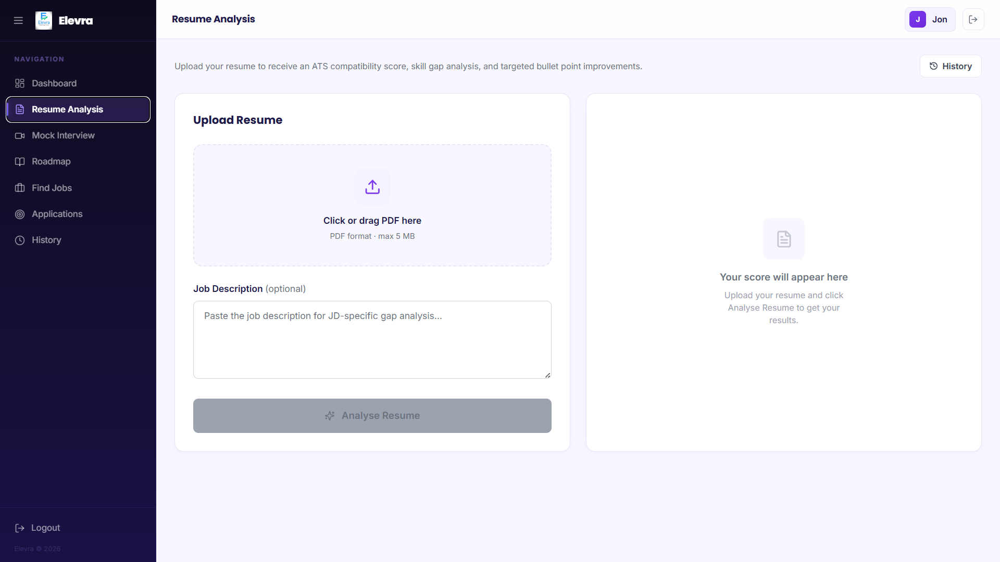
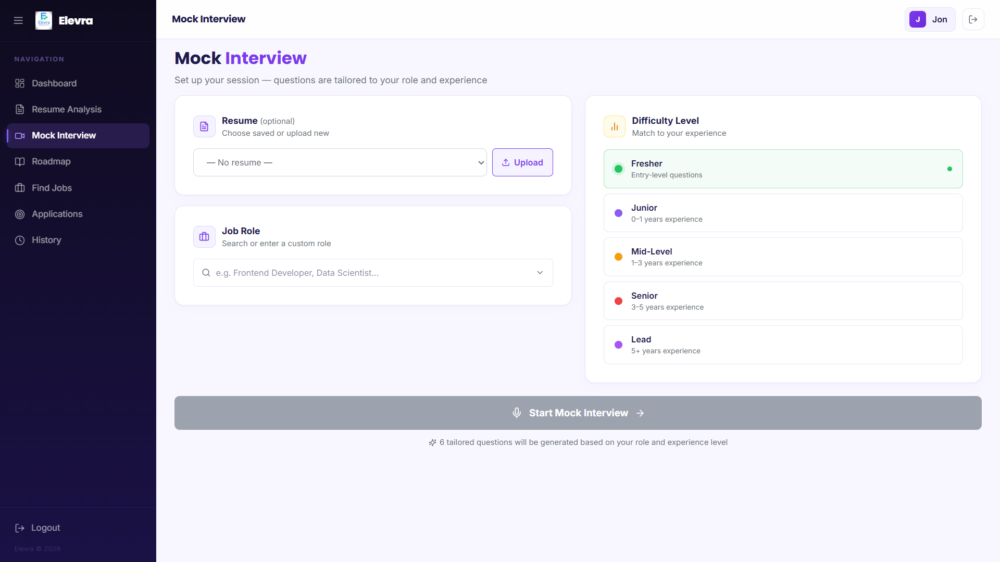
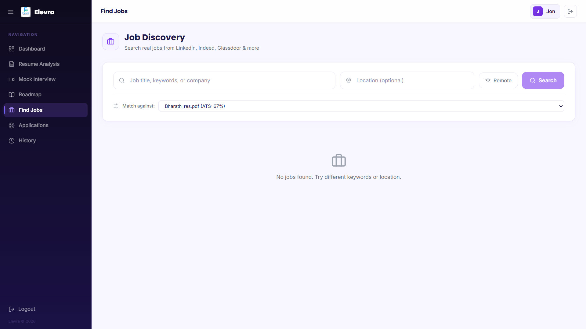

<div align="center">

# Elevra

**AI-powered career prep — resume feedback, mock interviews, and job matching in one platform**

[]()


**[🔗 Live App — elevraa.me](https://elevraa.me)**

</div>

---

## The problem

Most job seekers — especially freshers — get almost no real feedback until they're already rejected: a resume vanishes into an ATS black hole, or an interview goes badly with no idea why. **Elevra** closes that loop. It scores your resume the way an ATS would, runs mock interviews with actual audio/video analysis (not just canned questions), diffs your resume against a real job description, and rolls all of it into a single **Career Readiness Index** so you know exactly what to fix before you apply — then a companion browser extension auto-fills the application for you once you're ready.

> **Design note:** the backend runs a **unified AI client** that auto-detects whether it's talking to Gemini or Claude purely from the API key prefix (`AIza…` vs `sk-ant-…`), so the same codebase runs on either provider with zero config branching. The interview coach goes further than prompt-and-response: it runs real audio/video analysis (`faster-whisper` for speech, MediaPipe + DeepFace + OpenCV for eye contact and sentiment) rather than asking the LLM to guess at delivery from a transcript.

---

## Demo

<!--
  Add here:
  - A GIF of: upload resume → ATS score → mock interview → CRI dashboard
  - Screenshots: resume analysis, interview feedback, JD gap analysis, CRI score
  Since the app is live at elevraa.me, even 3-4 screenshots straight from the live site
  will do a lot of work here.
-->

**[Try it live →](https://elevraa.me)**

| Resume Analysis | Mock Interview | Job Search |
|---|---|---|
|  |  |  |

---

## Highlights

- **Live in production** at [elevraa.me](https://elevraa.me), self-hosted on Azure — not just a local demo
- **Provider-agnostic AI client** — swaps between Gemini and Claude by key prefix, no config changes needed
- **Real audio/video interview analysis** — speech-to-text via `faster-whisper`, eye contact and sentiment via MediaPipe/DeepFace/OpenCV, not just text-based scoring
- **Career Readiness Index** — a single composite score blending resume quality, interview performance, and skill gaps into one actionable number
- **JD gap analysis** — paste any job description and get a concrete, prioritized list of what's missing from your resume
- **Chrome/Edge extension (Manifest V3)** for one-click application autofill, bridged to the web app via a content script
- Full production deployment: Dockerized services behind Caddy (auto TLS), running on an Azure VM with custom domain + DNS

---

## Tech Stack

**Backend** — Python 3.11 · FastAPI (async) · SQLAlchemy · PostgreSQL · Alembic migrations · Google Gemini / Anthropic Claude (auto-detected) · `faster-whisper`, MediaPipe, DeepFace, OpenCV for interview analysis · Azure Blob Storage

**Frontend** — React 19 · TypeScript · Vite 6 · Tailwind CSS v4 · React Router v7 · Framer Motion

**Extension** — Manifest V3, vanilla JS content/background scripts bridged to the frontend

**Infra** — Docker Compose (backend + Postgres + nginx) · Caddy for automatic HTTPS · Azure VM · Namecheap DNS

---

## How the AI pipeline works

**Resume & JD intelligence:**
- Parses PDF/DOCX resumes, scores ATS compatibility, and extracts a structured skill set
- Diffs that skill set against a pasted job description to produce a gap analysis with concrete next steps

**Interview coaching:**
- Generates role-specific interview questions
- Captures audio/video responses and runs them through a real analysis pipeline — `faster-whisper` for transcription, MediaPipe/DeepFace for eye contact and facial sentiment, OpenCV for frame processing — rather than scoring delivery from text alone
- Produces structured feedback per answer, feeding into the overall Career Readiness Index

**Provider abstraction:**
- `ai_client.py` detects the configured provider from the API key format at startup and routes every call through one interface, so switching between Gemini and Claude is a one-line `.env` change, not a code change

---

## Getting Started

### Prerequisites
- Python 3.11+, Node.js 20+, PostgreSQL 15+
- A Gemini (`AIza…`) or Anthropic (`sk-ant-…`) API key
- *(Optional)* RapidAPI key for live job search, DigitalOcean/Azure Blob credentials for file storage

### Install & Run

```bash
git clone https://github.com/Bharath5626/elevra
cd elevra

cp .env.example .env
cp backend/.env.example backend/.env
# fill in DATABASE_URL, SECRET_KEY, AI_API_KEY at minimum

# Backend
cd backend
python -m venv venv && source venv/bin/activate   # Windows: venv\Scripts\activate
pip install -r ../requirements.txt

# Frontend
cd ../frontend
npm install
```

Run both together from the repo root:

```bash
python dev.py
```

| Service | URL |
|---|---|
| Frontend | http://localhost:5173 |
| Backend API | http://localhost:8000 |
| API docs (Swagger) | http://localhost:8000/docs |
| Health check | http://localhost:8000/health |

### Docker (full stack)

```bash
cp .env.example .env
docker compose up -d
docker compose exec backend bash -c "cd /app/backend && alembic upgrade head"
```

> Image includes `ffmpeg`, `libgl1`, and `libglib2.0-0` for audio/video analysis.

### Browser Extension

1. `chrome://extensions` → enable **Developer mode**
2. **Load unpacked** → select the `extension/` folder
3. The Elevra One-Click Apply icon appears in your toolbar, reading your saved profile to auto-fill applications

---

## API Overview

Routes are registered at root (no `/api/v1` prefix by default). Interactive docs at `/docs` (Swagger) and `/redoc`.

| Prefix | Module |
|---|---|
| `/auth` | Register, login, JWT refresh |
| `/resume` | Upload, parse, score, analyse |
| `/jd` | Job description gap analysis |
| `/interview` | Generate questions, submit responses, evaluate |
| `/jobs` | Live job search |
| `/cri` | Career Readiness Index |
| `/roadmap` | AI career roadmap |
| `/profile` | User profile CRUD |

<details>
<summary>Full environment variable reference</summary>

| Variable | Description | Default |
|---|---|---|
| `APP_NAME` | Application display name | `Elevra` |
| `DEBUG` | Enable debug mode / SQL logging | `false` |
| `API_V1_PREFIX` | Optional route prefix (e.g. `/api/v1`) | *(empty)* |
| `DATABASE_URL` | PostgreSQL async connection string | — |
| `SECRET_KEY` | JWT signing key (32+ chars) | — |
| `ALGORITHM` | JWT algorithm | `HS256` |
| `ACCESS_TOKEN_EXPIRE_MINUTES` | Token TTL in minutes | `10080` (7 days) |
| `AI_API_KEY` | Gemini (`AIza…`) or Anthropic (`sk-ant-…`) key | — |
| `GEMINI_MODEL` | Gemini model name | `gemini-2.5-flash` |
| `CLAUDE_MODEL` | Claude model name | `claude-3-5-sonnet-20241022` |
| `AZURE_STORAGE_CONNECTION_STRING` | Azure Blob Storage connection string | *(optional)* |
| `AZURE_STORAGE_CONTAINER` | Blob container name | `careerai-media` |
| `FRONTEND_URL` | Allowed CORS origin | `http://localhost:5173` |
| `RAPIDAPI_KEY` | RapidAPI key for JSearch job listings | *(optional)* |

</details>

---

## Project Structure

```
elevra/
├── backend/app/
│   ├── auth/        # JWT auth, password hashing
│   ├── resume/       # Parser, ATS scorer, skill extractor, embedder
│   ├── interview/    # Question generator, evaluator, audio/video pipeline
│   ├── jd/           # Job description gap analysis
│   ├── jobs/         # Live job search (RapidAPI)
│   ├── cri/          # Career Readiness Index calculator
│   ├── roadmap/      # AI career roadmap generator
│   ├── profile/      # User profile management
│   ├── ai_client.py  # Unified Gemini / Claude client
│   └── main.py       # FastAPI app, CORS, routers
├── frontend/src/      # React + TypeScript
├── extension/         # Manifest V3 Chrome/Edge extension
├── dev.py             # One-command dev launcher
└── docker-compose.yml
```

---

## Production Deployment

Elevra runs in production on an Azure VM (Docker Compose: backend + PostgreSQL + nginx), fronted by Caddy for automatic HTTPS, on a custom domain via Namecheap DNS.

Full step-by-step deployment guide — Azure VM provisioning, Blob Storage setup, Docker Compose deploy, Caddy/TLS config, DNS records, and the managed Azure Container Apps alternative — is in [`docs/deployment.md`](docs/deployment.md).

<details>
<summary>Quick reference: production deploy commands</summary>

```bash
# On the VM, after cloning and configuring .env
docker compose up -d --build
docker compose exec backend bash -c "cd /app/backend && alembic upgrade head"
docker compose ps
```

Admin account bootstrap (one-time, after first deploy):
```bash
curl -X POST https://your-api-url/admin/init \
  -H "Content-Type: application/json" \
  -d '{"secret": "YOUR_ADMIN_SECRET", "email": "admin@example.com", "password": "yourpassword", "name": "Admin"}'
```

</details>

---

## License

MIT
